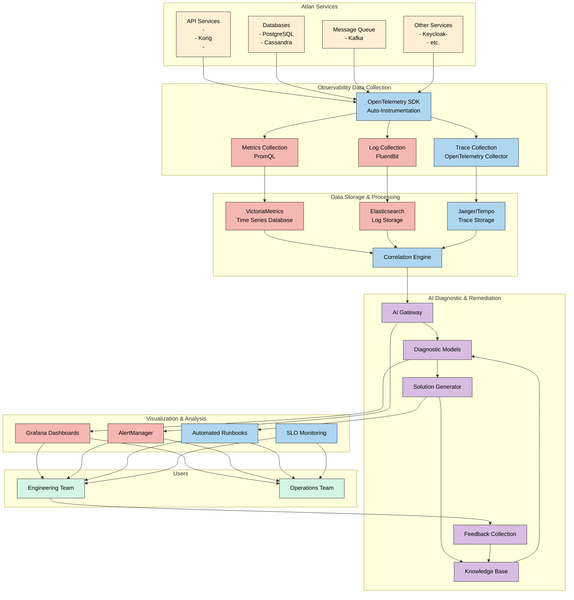
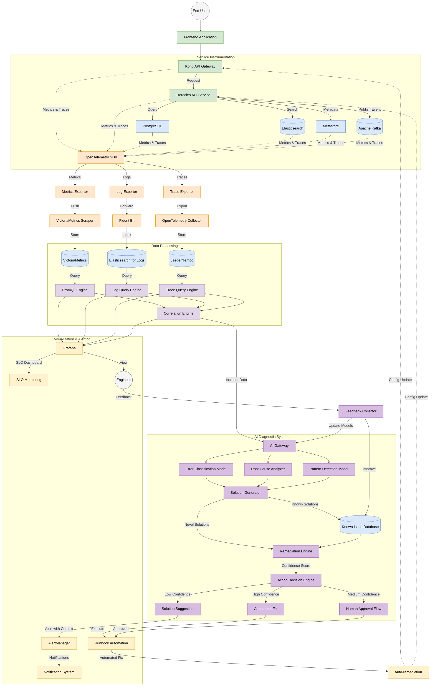
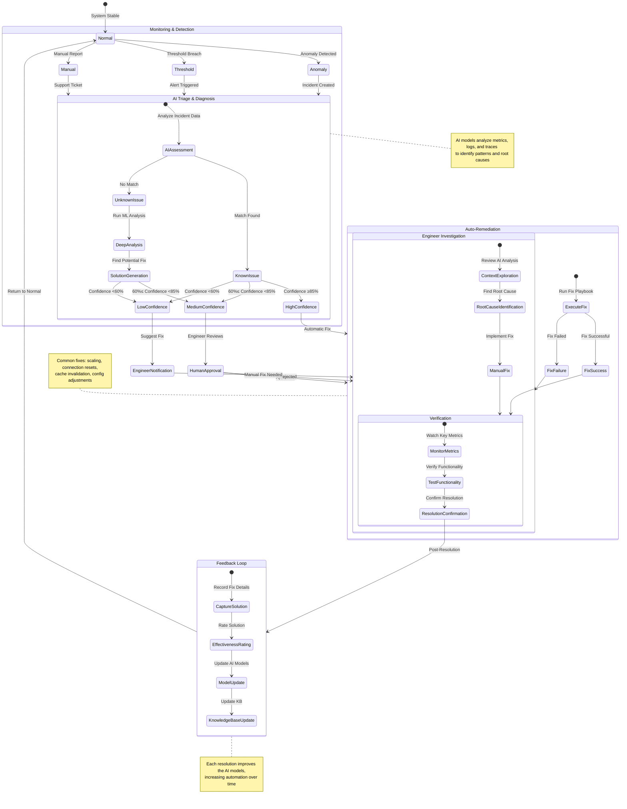

#  Atlan Platform Observability Solution

## 1. Introduction

This document presents a comprehensive observability solution for Atlan's platform, addressing debugging challenges faced by engineering teams. The solution now incorporates AI-powered diagnostic and remediation capabilities to further reduce issue detection and resolution times, making the system more self-healing and less dependent on manual intervention.

## 2. Problem Statement

The engineering team faces several key challenges in debugging:
- Slow identification of root causes
- Repetitive manual troubleshooting processes
- Inconsistent debugging approaches
- Heavy dependence on experienced engineers
- Outdated and irrelevant logs
- Delayed resolution of known issues
- Knowledge gaps between senior and junior engineers

## 3. High-Level System Design

### 3.1 Observability Stack Components

### 3.1.1 Observability Data Flow

The enhanced observability stack consists of:

1. **Data Collection Layer**
   - OpenTelemetry SDK integration for application instrumentation
   - Metric exporters for VictoriaMetrics (already in Atlan's stack)
   - Log aggregation via FluentBit (already in Atlan's stack)
   - Distributed tracing collector for end-to-end request visibility

2. **Storage & Processing Layer**
   - VictoriaMetrics for time-series metrics (already in Atlan's stack)
   - Elasticsearch for log data (already in Atlan's stack)
   - Jaeger or Tempo for distributed trace storage
   - Correlation engine for cross-telemetry analysis

3. **AI Diagnostic & Remediation Layer** 
   - AI Gateway for service orchestration and API access
   - Diagnostic models for error classification and root cause analysis
   - Solution generator for automated remediation suggestions
   - Knowledge base of known issues and solutions
   - Feedback loop for continuous model improvement

4. **Visualization & Analysis Layer**
   - Grafana dashboards (already in Atlan's stack)
   - Automated alerting via AlertManager (already in Atlan's stack)
   - Custom service health scorecards
   - AI-enhanced runbook automation for common issues

5. **Automation Layer**
   - Auto-instrumentation of new services
   - AI-powered remediation suggestions
   - Automated fix implementation for high-confidence solutions
   - Human approval workflow for medium-confidence solutions

### 3.2 Data Flow

1. Applications are instrumented with OpenTelemetry SDK
2. Telemetry data (metrics, logs, traces) is collected and processed
3. Correlation engine connects related events across telemetry types
4. AI models analyze correlated data to diagnose root causes
5. Solution generator proposes remediation options
6. Depending on confidence level, solutions are:
   - Automatically implemented (high confidence)
   - Sent for human approval (medium confidence)
   - Suggested as part of alerts (low confidence)
7. Feedback from resolutions improves AI models over time

## 4. Implementation Strategy

### 4.1 Metrics Implementation

#### Important Metrics and Rationale

| Metric Category | Specific Metrics | Rationale |
|----------------|-----------------|-----------|
| **Request-level** | - Request rate - Error rate - Latency percentiles (p50, p95, p99) - Request payload size | These provide overall health indicators for API endpoints. Percentiles help identify the "long tail" problems affecting some users. |
| **Resource utilization** | - CPU usage - Memory consumption - Garbage collection metrics - Thread pool utilization | Resource bottlenecks often cause performance issues. These metrics help identify when scaling or optimization is needed. |
| **Dependency metrics** | - Database query latency - External API call latency - Cache hit/miss ratio - Queue depth | Many API issues stem from problems with dependencies. These metrics help isolate which dependency might be causing slowdowns. |
| **Business metrics** | - Operation success rate - User-impacting errors - SLA compliance | These connect technical issues to business impact, helping prioritize fixes. |

### 4.2 Logging Strategy

#### Log Level Guidelines

| Log Level | Purpose | Retention | Examples |
|-----------|---------|-----------|----------|
| ERROR | Critical failures requiring immediate attention | 30 days | - Database connection failures - Authentication failures - Data corruption |
| WARN | Potential issues that don't prevent operation | 14 days | - Retried operations - Deprecated API usage - Performance anomalies |
| INFO | Normal operation milestones | 7 days | - Request started/completed - Major workflow steps - Configuration loaded |
| DEBUG | Detailed troubleshooting information | 2 days | - Parameter values - Intermediate calculation results - Cache operations |

#### Logging Best Practices

1. **Structured Logging**: All logs should be in JSON format for easier parsing and filtering
2. **Context Enrichment**: Include request ID, user ID, service name, and other relevant context
3. **Sampling Strategy**: Sample debug logs in production to reduce volume
4. **Log Rotation**: Implement based on time and size with appropriate retention policies

### 4.3 Tracing Implementation

1. **Trace Context Propagation**: Ensure all services propagate trace context headers
2. **Span Attributes**: Enrich spans with useful attributes like:
   - HTTP method, status code, URL
   - Database operation type, query type
   - Error details when failures occur
3. **Custom Spans**: Create spans for key business operations
4. **Sampling Strategy**: Sample traces intelligently based on service importance and error status

### 4.4 AI Diagnostic & Remediation Implementation

#### AI Model Types

| Model Type | Purpose | Training Data |
|------------|---------|--------------|
| **Error Classifier** | Categorize errors into known patterns | Historical incident data, error logs |
| **Root Cause Analyzer** | Identify underlying causes from symptoms | Past incidents with resolved root causes |
| **Pattern Detector** | Detect anomalies and recurring patterns | Normal and abnormal telemetry data |
| **Solution Generator** | Suggest or implement fixes | Historical resolutions, runbooks, best practices |

#### Confidence Levels and Actions

| Confidence Level | Score Range | Action |
|------------------|-------------|--------|
| **High** | 85-100% | Automatically implement fix through runbooks |
| **Medium** | 60-84% | Suggest fix for human approval with implementation path |
| **Low** | <60% | Surface as suggestion with context in alerts |

#### Solution Types

1. **Configuration Changes**: Update service parameters without code changes
   - Connection pool sizes, timeouts, retry policies
   - Resource allocation, scaling thresholds
   - Feature flags and circuit breakers

2. **Infrastructure Actions**: Make changes to infrastructure
   - Service restart or relocation
   - Database index rebuilds
   - Cache invalidation
   - Load balancer configuration 

3. **Code Fix Suggestions**: Provide guidance for code-level fixes
   - Anti-pattern identification with solution patterns
   - Performance optimization suggestions
   - Error handling improvements

#### Feedback Collection

1. **Resolution Success Tracking**: Measure if implemented solutions resolved the issue
2. **Engineer Ratings**: Allow engineers to rate solution quality
3. **Override Tracking**: Record when engineers select different solutions
4. **Improvement Suggestions**: Collect engineer improvements to suggested solutions
5. **Model Update Pipeline**: Use feedback to improve future recommendations

## 5. Enhanced Incident Resolution Workflow

## 6. Problem Resolution Approach

### 6.1 Addressing Current Problems

1. **Slow Root Cause Identification**
   - Implement distributed tracing to pinpoint bottlenecks
   - Create correlation between metrics, logs, and traces
   - Deploy AI diagnostics to rapidly analyze correlated data
   - Provide context-rich alerts with probable causes

2. **Repetitive Manual Troubleshooting**
   - Create runbooks for common issues
   - Develop self-service troubleshooting tools
   - Implement AI-powered automation for recurring issues
   - Auto-implement high-confidence fixes

3. **Inconsistent Debugging**
   - Standardize observability patterns across services
   - Create service templates with built-in observability
   - Develop team training on observability tools and approaches
   - Use AI to enforce consistent debugging approaches

4. **Dependency on Experienced Engineers**
   - Document tribal knowledge in knowledge base
   - Create AI models that learn from expert resolutions
   - Build guided remediation workflow for junior engineers
   - Provide confidence scores for suggested solutions

5. **Outdated and Irrelevant Logs**
   - Audit and clean up existing logs
   - Implement log rotation and retention policies
   - Create guidelines for meaningful logging
   - Use AI to highlight relevant logs during incidents

### 6.2 Measuring Improvement Impact

To track how much the improvements have helped the team:

1. **Quantitative Metrics**:
   - Mean Time To Detection (MTTD) of issues
   - Mean Time To Resolution (MTTR)
   - Number of incidents requiring escalation
   - Frequency of similar recurring issues
   - Percentage of issues resolved automatically
   - AI solution acceptance rate

2. **Qualitative Metrics**:
   - Regular surveys of engineering team satisfaction with debugging experience
   - "Friction log" collection during incident response
   - Peer review of post-incident reports
   - Engineer ratings of AI-suggested solutions

3. **Automation Metrics**:
   - Percentage of issues automatically detected before user reports
   - Self-service resolution rate
   - Dashboard usage statistics
   - AI solution confidence scores over time
   - Knowledge base growth and utilization

## 7. AI Model Training and Improvement

### 7.1 Initial Training Data Sources

1. **Historical Incident Records**:
   - Past incident reports and resolutions
   - Post-mortem documentation
   - Identified root causes
   - Solution effectiveness records

2. **Expert Knowledge Capture**:
   - Structured interviews with senior engineers
   - Documentation of troubleshooting approaches
   - Recorded debugging sessions
   - Common fix patterns

3. **Synthetic Data Generation**:
   - Simulated failure scenarios
   - Load testing results
   - Chaos engineering outcomes
   - Deliberately induced errors with known resolutions

### 7.2 Continuous Improvement Process

1. **Feedback Collection Pipeline**:
   - Capture resolution effectiveness
   - Record engineer interactions with suggestions
   - Track manual overrides and modifications
   - Monitor solution performance metrics

2. **Model Retraining Strategy**:
   - Scheduled retraining intervals (weekly/monthly)
   - Triggered retraining on feedback thresholds
   - A/B testing of model improvements
   - Progressive deployment of updated models

3. **Knowledge Base Expansion**:
   - Automated extraction of new patterns
   - Solution categorization and tagging
   - Cross-referencing with external knowledge sources
   - Versioning of solutions for different system states

4. **Performance Evaluation**:
   - Model accuracy metrics
   - False positive/negative tracking
   - Time saved per incident
   - Engineer satisfaction scores

## 8. Known Gaps and Limitations

1. **Legacy System Integration**: Some legacy systems may be difficult to instrument fully
   - Mitigation: Use proxy-based monitoring and contextual analysis where direct instrumentation isn't possible

2. **Cost Implications**: Comprehensive observability with AI increases infrastructure costs
   - Mitigation: Implement intelligent sampling, tiered storage policies, and optimize AI resource usage

3. **Privacy Considerations**: Logging may capture sensitive user data
   - Mitigation: Implement data scrubbing, privacy-preserving learning techniques, and compliance with regulations

4. **Team Adaptation**: Teams will need time to adapt to AI-augmented workflows
   - Mitigation: Phased rollout with adequate training, clear documentation, and gradual introduction of AI capabilities

5. **AI Confidence Limitations**: Not all issues will have high-confidence solutions
   - Mitigation: Progressive improvement through feedback loops and clear handoff to human engineers when needed

6. **False Positives/Negatives**: AI models may sometimes provide incorrect diagnoses
   - Mitigation: Conservative confidence thresholds, human verification for critical systems, continuous model improvement

## 9. Conclusion

The enhanced observability solution with AI-powered diagnostics and remediation addresses the core debugging challenges faced by Atlan's engineering team. By implementing comprehensive instrumentation, correlation across telemetry types, and automated analysis with intelligent remediation, we can significantly reduce time to resolution and dependence on experienced engineers.

This approach leverages Atlan's existing architecture components while introducing new capabilities for distributed tracing, correlation, and AI-driven problem-solving. The solution creates a semi-autonomous system that not only detects issues but also helps resolve them with minimal human intervention, while continuously learning from each incident.

The phased implementation approach ensures that teams can adapt gradually while beginning to see benefits from early stages, with the AI capabilities becoming more powerful and autonomous as the system learns from real-world usage.